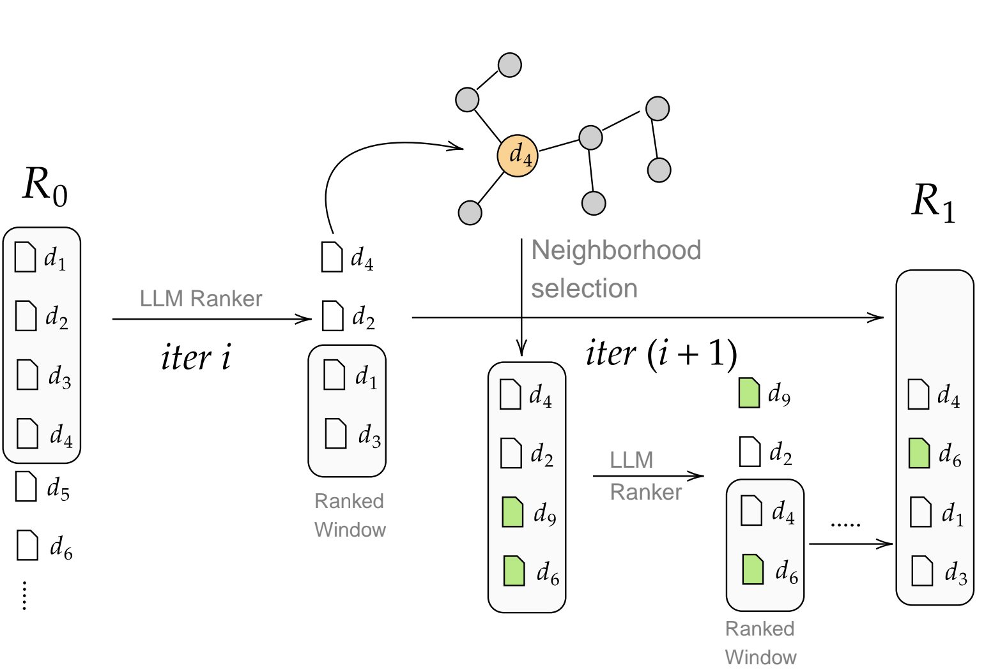

# Guiding Retrieval using LLM-based Listwise Rankers

This is official repository for our paper (Guiding Retrieval using LLM-based Listwise Rankers) accepted in ECIR, 2025.  

<p align="center">
  
</p>

## Setup

### Requirements
We have added all dependencies in requirements.txt file which can be downloaded as follows:


```
pip install "rerankers[all]"
pip install --upgrade git+https://github.com/terrierteam/pyterrier_adaptive.git
pip install pyterrier_pisa==0.0.6
pip install pyterrier_alpha
```

## Corpus Graph

We use the coprus graphs from the [GAR](https://arxiv.org/pdf/2208.08942) paper.
For instance, the bm25 based corpus graph can be downloaded using:
```
from pyterrier_adaptive import  CorpusGraph
graph = CorpusGraph.from_dataset('msmarco_passage', 'corpusgraph_bm25_k16')
```

## Reproduction


Our results can be reproduced by using the `evaluate.py` file. Additionally, we have also provided the saved runs in the  `saved_pyterrier_runs/` folder.


```
python3 evaluate.py --model_name zephyr --model_type rankllm --budget 50 --verbose --dl_type 19
```


